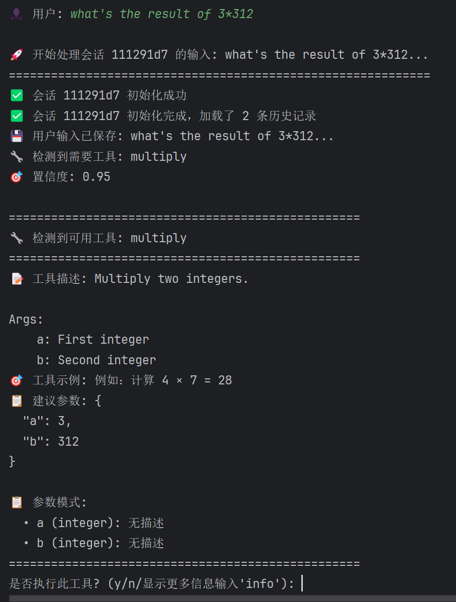
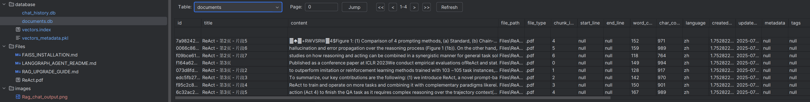
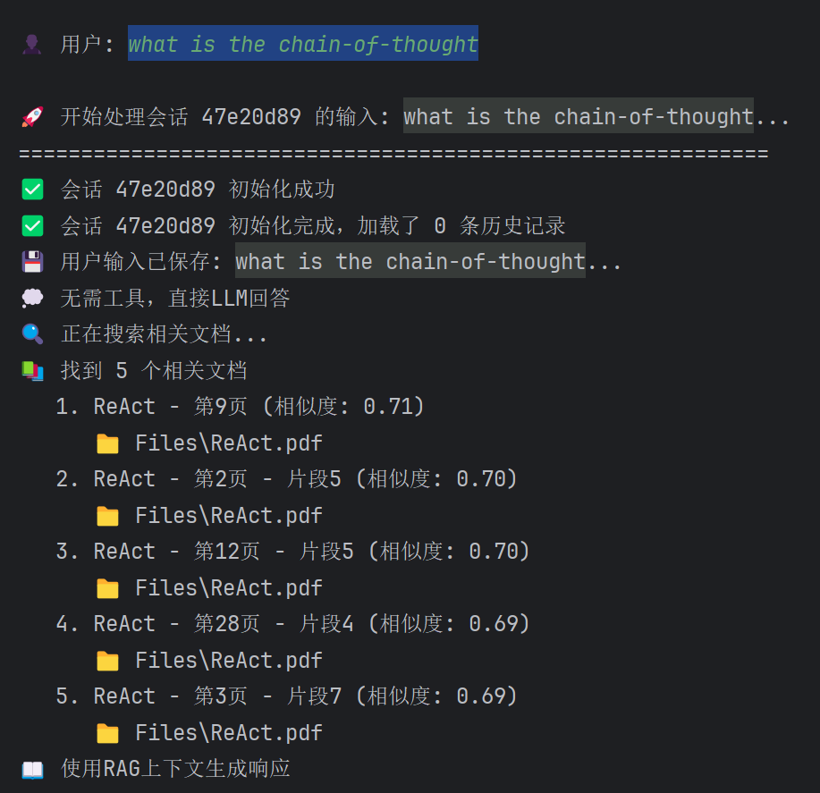
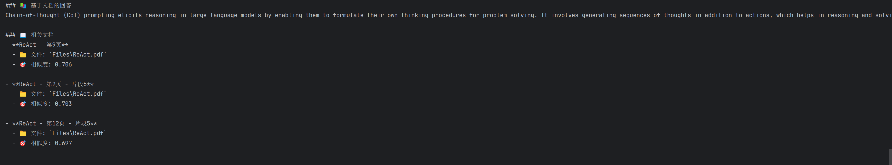

## Setup environment
1. Run with uv
    ```powershell
    uv venv
    .venv\Scripts\activate
    uv sync # install packages
    ```
2. rename `.env.template` to `.env` and set up correct api key 

## Configuration
You can configure the settings in the settings.py file to specify which the model, embedding, db you use. 
By default, I use the `azure openai` model, `azure openai embedding`, `database under the database folder named chat_history.db, documents.db`

## Simple Start 
```powershell
uv run quick_start.py

```
select 1 to chat with the bot and input following text one by one to test different features:
1. My name is Jun from China.
2. Could you recommend some cities to travel in my country?  // to test the Context Memory of current session
3. Do you know what's my name? // to test the Context Memory of current session
4. Could you introduce the advantages of MCP (Model Context Protocol)? // summarize the large Context Memory of current session
5. Could you show more details about Consistency you said? // ensure the memory still works after summarization
6. what's the result of 3*312  // test tools
   

## start with your RAG
```powershell
uv run quick_start.py # select 2 to upload your knowledge file, I upload ReAct.pdf by default, of course you could upload your own file
```

```
uv run quick_start.py # select 1 to chat with the bot
input: what is the chain-of-thought
```


